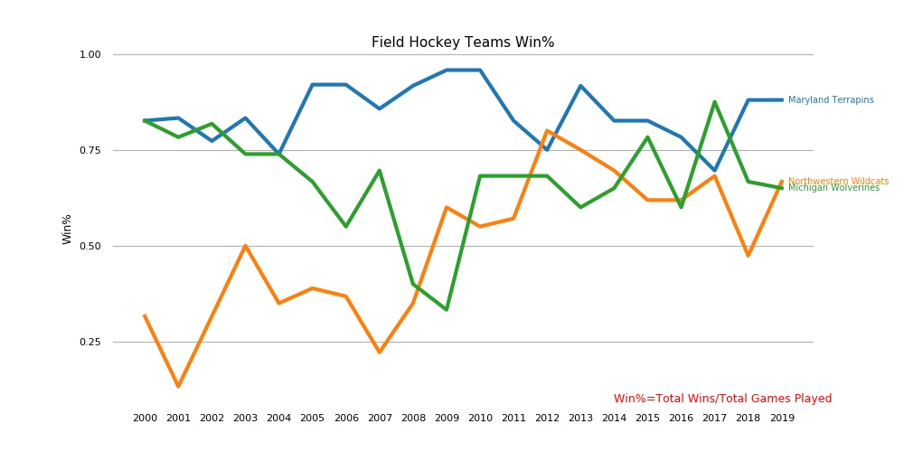

# SportDataVisualization

python, matplotlib, numpy, pandas

This analysis is based on project for "Applied Plotting, Charting & Data Representation in Python" Coursera course.

## Region and Domain
Ann Arbor, Michigan, United States and United States
Field Hockey

## Research Question
How have the win ratio percentages have changes over time for three sports team (Michigan Wolverines, Northwestern Wildcats, Maryland Terrapins) over 20 years?

## Data Links
https://en.wikipedia.org/wiki/Northwestern_Wildcats_field_hockey
https://en.wikipedia.org/wiki/Maryland_Terrapins_field_hockey

https://en.wikipedia.org/wiki/Michigan_Wolverines_field_hockey#:~:text=%20%20%20Full%20name%20%20%20Michigan,%20Marcia%20Pankratz%20%202%20more%20rows%20

## Visualization

## Design Choices
The plot is truthful as it employs a consistent y-axis and x-axis to represent the data. Everything is represented on the same scale which makes it easier to compare and does not distort data in any way.
The visualization uses clutter-free plotting with a beautiful color palette.
The plot is functional enough to answer basic questions about the win ratio for all the teams under consideration.
It answers the questions regarding the overall trend in the performance and which teams were most consistent and which years were worst for the teams in terms of win %.
 
## Analysis
This visualization tries to look at the performance of three university teams (Michigan Wolverines, Northwestern Wildcats and Maryland Terrapins) over a 10-year period from 2000 to 2019. The visualization looks at the win ratio. From the plot it appears that Terrapins had overall a better victory rate than the other teams in comparison. It had the most consistent performance over the last 10 years. Wolverines win percentage took a dip in 2009. Wildcats team had the most improvement during this time period.
